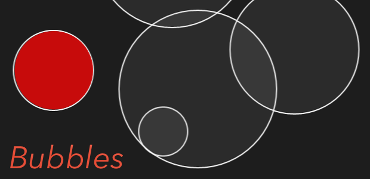

bubbles
=======

A small demo for a pressure sensitive Windows 8 screen with multi touch.

## Overview 

This app was made as a demo for a new brand of pressure sensitive monitors, using Windows 8 touch APIs. 

The goal was to write a game, but I dare say the gaming aspect suffered a bit, it turned out more like a little distraction. But it was good fun writing it. 

The sounds are made using the same NAudio library I started using when writing Touchbox (see neighbouring repository). 

[Exclusive video footage of the demo.](https://youtu.be/gLL_2k4XqoA)

